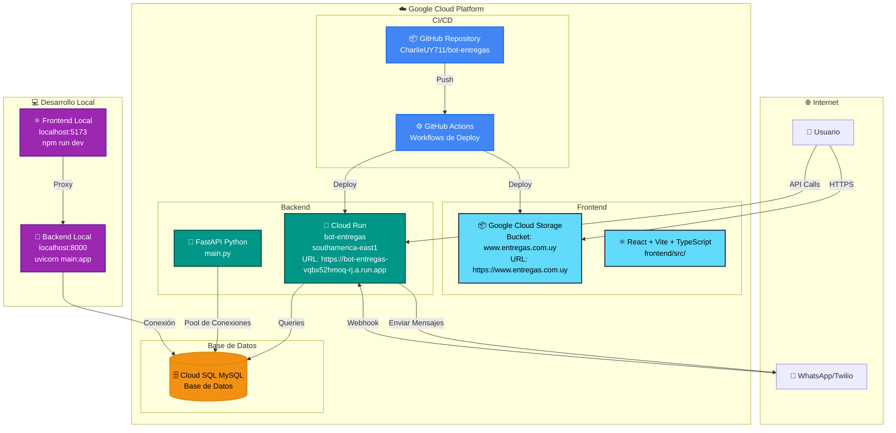
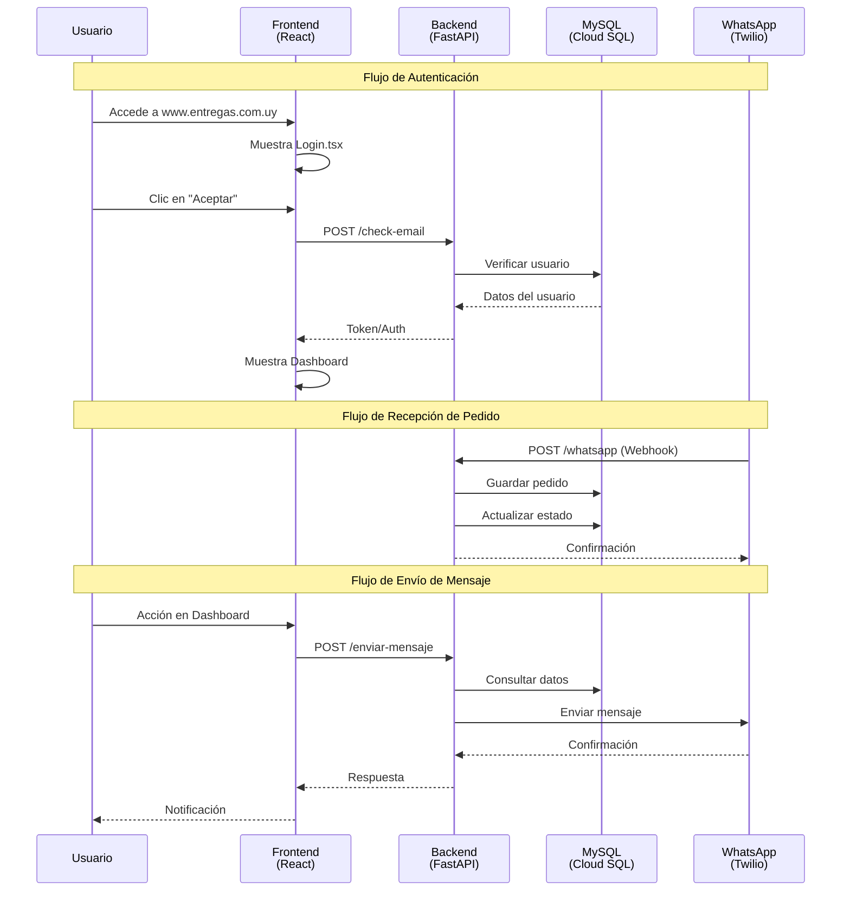
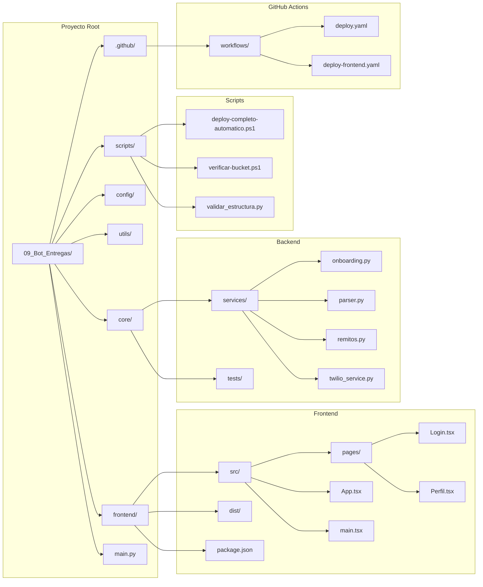
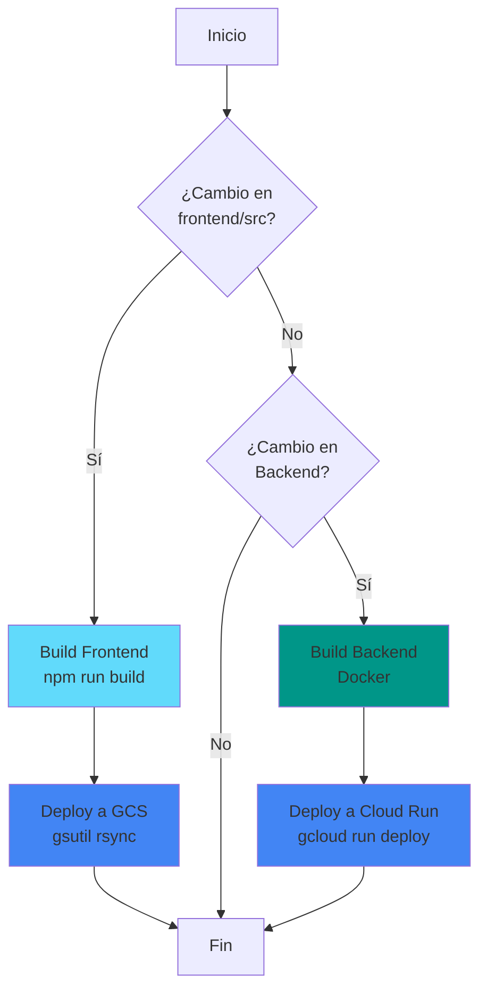

# 📊 Diagrama de Arquitectura - Plataforma de Entregas

## 🎯 Punto de Reconstrucción del Sistema

Este documento contiene el diagrama visual completo de la arquitectura del sistema para facilitar la reconstrucción y comprensión del proyecto.

---

## 🏗️ Arquitectura Completa del Sistema

---

## 🔄 Flujo de Datos - Proceso de Entrega

---

## 📁 Estructura de Directorios

---

## 🔐 Componentes y Tecnologías

### Frontend
- **Framework**: React 18
- **Build Tool**: Vite
- **Lenguaje**: TypeScript
- **Estilos**: Tailwind CSS
- **Hosting**: Google Cloud Storage
- **URL**: https://www.entregas.com.uy

### Backend
- **Framework**: FastAPI (Python)
- **Servidor**: Uvicorn
- **Hosting**: Google Cloud Run
- **Región**: southamerica-east1
- **URL**: https://bot-entregas-vqbx52hmoq-rj.a.run.app

### Base de Datos
- **Tipo**: MySQL
- **Hosting**: Google Cloud SQL
- **Pool de Conexiones**: MySQL Connector Pool

### Integraciones
- **WhatsApp**: Twilio API
- **CI/CD**: GitHub Actions
- **Storage**: Google Cloud Storage

---

## 🚀 Procesos de Deploy

---

## 📋 Endpoints Principales

### Backend API

| Método | Endpoint | Descripción |
|--------|----------|-------------|
| GET | `/` | Estado del servicio |
| GET | `/ping-db` | Verificación de conexión MySQL |
| POST | `/whatsapp` | Webhook de recepción de pedidos |
| POST | `/enviar-mensaje` | Envío de mensajes salientes |
| POST | `/check-email` | Verificar email de usuario |

---

## 🔧 Variables de Entorno

### Backend (.env)
- `DB_HOST`: Host de Cloud SQL
- `DB_USER`: Usuario de MySQL
- `DB_PASSWORD`: Contraseña de MySQL
- `DB_NAME`: Nombre de la base de datos
- `TWILIO_ACCOUNT_SID`: Account SID de Twilio
- `TWILIO_AUTH_TOKEN`: Auth Token de Twilio
- `TWILIO_PHONE_NUMBER`: Número de teléfono de Twilio

### Frontend
- `VITE_API_URL`: URL del backend (producción o local)

---

## 📝 Notas de Reconstrucción

1. **Frontend**: El código fuente está en `frontend/src/`, el build compilado en `frontend/dist/`
2. **Backend**: El código principal está en `main.py` y los servicios en `core/services/`
3. **Base de Datos**: La conexión se configura en `config/env.py` y `config.py`
4. **Deploy**: Los scripts automatizados están en `scripts/`
5. **CI/CD**: Los workflows están en `.github/workflows/`

---

## 🎯 Estado Actual del Sistema

- ✅ Frontend desplegado en GCS
- ✅ Backend desplegado en Cloud Run
- ✅ Base de datos en Cloud SQL
- ✅ GitHub Actions configurado
- ✅ Integración con Twilio funcionando
- ⚠️ Algunos componentes del frontend pendientes (Perfil, Entregas Perdidos)

---

*Última actualización: $(Get-Date -Format "yyyy-MM-dd")*
